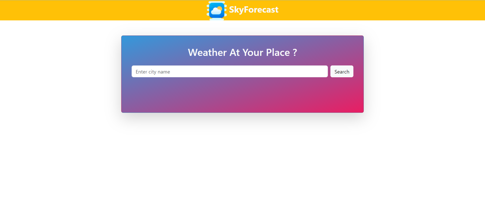

# SkyForecast Weather App

SkyForecast is a web application that provides real-time weather information for different cities. Users can search for a city and get details about its current weather conditions, including temperature, humidity, wind speed, and more.

## Features

- Real-time weather information for cities.
- User-friendly interface with a clean design.
- Displays weather icon, temperature, description, and additional details.
- Responsive layout using Bootstrap.

## Screenshots

## How to Use

1. Open the app in your web browser.
2. Enter the name of the city in the input field.
3. Click the "Search" button to get weather information for the entered city.
4. The app will display the current weather conditions, including temperature, humidity, wind speed, and more.

## Technologies Used

- HTML
- CSS (Bootstrap)
- JavaScript

## API Integration

The app fetches weather data using a weather API. Make sure to update the API key in the `script.js` file to access real-time weather information.
